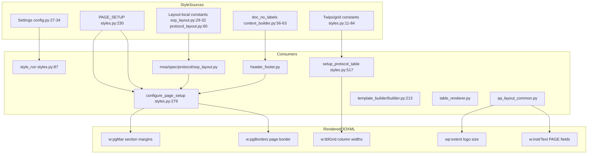

# AUDIT — Track A Phase A: Config-Externalization Assessment

**Scope:** READ-ONLY assessment for Track A externalization of DOC-Module styling into `sop_style.yaml`.  
**Repo:** `AC-QMS-DOC-Module`  
**Date:** 2026-07-10  
**Constraint:** No code changes in this phase — mapping and verdict only.

---

## Style authority references

| Document | Path | Role |
|----------|------|------|
| QA-01-01_STYLE_SPEC_FINAL.md | **Not found in workspace** | User-attached target spec (§6 YAML shape, §1.2 margin profiles). Replace references below when available. |
| QA-01 extract | [`../AC-QMS-DEV-DOCS/reference-sops/02_document_styling.md`](../AC-QMS-DEV-DOCS/reference-sops/02_document_styling.md) | Standing SOP extract — page setup, fonts, header/footer structure |
| Prior cross-ref | [`SOP_STYLE_CROSSREF.md`](SOP_STYLE_CROSSREF.md) | Code-vs-SOP comparison; FILLED VALUES table; divergence ranking |

**Key finding (reconfirmed):** The real styling seam is `PAGE_SETUP` in [`app/document_engine/styles.py`](app/document_engine/styles.py) (`:230-276`), **not** margin fields in [`app/core/config.py`](app/core/config.py) (`:32-34`), which are defined but never read at runtime.

---

## 1. Consumption map

### 1.1 Architecture overview



**Render flow:**

1. `DocumentRenderer.render()` ([`renderer.py:54-86`](app/document_engine/renderer.py)) calls `build_document_context()`.
2. For MOA / Protocol / Spec / SOP: `PROGRAMMATIC_LAYOUTS[document_type](doc, context)` — each `apply_*_layout` calls `configure_page_setup` then builds header/footer/body tables.
3. For Annexure / docxtpl types: `DocxTemplate.render()` then `_post_process()` → `apply_header_footer_to_document()` ([`renderer.py:103`](app/document_engine/renderer.py), [`header_footer.py:116-130`](app/document_engine/components/header_footer.py)).

---

### 1.2 PAGE_SETUP (page margins, header/footer distance, page border)

| Defined | Read by | Render effect | Scope |
|---------|---------|---------------|-------|
| [`styles.py:230-276`](app/document_engine/styles.py) `PAGE_SETUP` dict | `configure_page_setup()` (`:279-284`) | Sets `section.top/right/bottom/left_margin`, `header_distance`, `footer_distance`; optional `set_page_border()` | **Per `DocumentType`** |

**Call sites (every section in document):**

| File | Line | DocumentType |
|------|------|--------------|
| [`moa_layout.py`](app/document_engine/components/moa_layout.py) | 159 | `MOA` |
| [`spec_layout.py`](app/document_engine/components/spec_layout.py) | 483 | `SPECIFICATION` |
| [`protocol_layout.py`](app/document_engine/components/protocol_layout.py) | 481 | `PROTOCOL` |
| [`sop_layout.py`](app/document_engine/components/sop_layout.py) | 128 | `SOP` |
| [`header_footer.py`](app/document_engine/components/header_footer.py) | 119 | From argument or context (Annexure/docxtpl) |
| [`template_builder/builder.py`](template_builder/builder.py) | 213 | From `config.document_type` |
| [`table_renderer.py`](app/document_engine/table_renderer.py) | 80-81 | Legacy alias → `DocumentType.SOP` |

**Not in PAGE_SETUP:** `STANDARD_FORMAT` — `configure_page_setup` falls back to SOP profile (`styles.py:280`).

---

### 1.3 Fonts

| Defined | Read by | Render effect | Scope |
|---------|---------|---------------|-------|
| `default_font` [`config.py:28`](app/core/config.py) | `style_run()` (`styles.py:90`) | `run.font.name` on all styled runs | **Global** (env-overridable via Pydantic Settings) |
| `default_font_size` [`config.py:29`](app/core/config.py) | `style_run()` (`styles.py:91`) | `run.font.size = Pt(12)` default | **Global** |
| Direct `get_settings()` + `Pt()` | `header_footer.py:65-66`, `94-95`; `sop_layout.py:71-72`; `qa_layout_common.py:131-132`, `197-198`; `table_renderer.py:35-36`; `template_builder/builder.py:25-26` | Page-number label runs, restricted-text line, dynamic table titles | **Global** |

**Heading treatment:** No separate heading size — bold at 12 pt via `style_run(run, bold=True)` (e.g. `sop_layout.py:89`).

---

### 1.4 Spacing (twips constants)

| Constant | Defined | Read by | Render effect | Scope |
|----------|---------|---------|---------------|-------|
| `PROTOCOL_SPACER_LINE_TWIPS = 360` | `styles.py:76` | `set_paragraph_spacing_twips` default (`:462`); `style_qa_cell` (`qa_layout_common.py:117`); `build_six_col_metadata_header` (`:274,321`); `sop_layout.py:64,75`; `protocol_layout.py:77,134,155` | `w:spacing w:line="360"` — ~18 pt line height in QA cells | **Global** |
| `PROTOCOL_SECTION_GAP_TWIPS = 120` | `styles.py:77` | `protocol_layout.py:334-335` | Gap between summary and sign-off tables | **Global** |
| `DETAIL_COMPACT_LINE_TWIPS = 240` | `styles.py:79` | `set_cell_paragraphs` compact mode (`:130`); `protocol_layout.py:406-407,445,452` | Tighter procedure/detail cell rows | **Global** |
| `DETAIL_CELL_MARGIN_TWIPS = 40` | `styles.py:80` | `set_cell_margins_dxa` default top/bottom (`:139-140`) | `w:tcMar` internal cell padding | **Global** |
| Cell margin L/R `108` dxa | `styles.py:141-142` | `set_cell_margins_dxa` | Detail cell horizontal padding | **Global** (hardcoded default arg) |
| `HEADER_LOGO_ROW_HEIGHT_TWIPS = 943` | `styles.py:84` | `set_row_height` in `build_six_col_metadata_header` (`qa_layout_common.py:303`); `protocol_layout.py:108` | Fixed logo row height in 6-col headers | **Global** |

---

### 1.5 Borders

| Defined | Read by | Render effect | Scope |
|---------|---------|---------------|-------|
| `apply_cell_borders(val="single", sz="4")` `styles.py:174-182` | `setup_protocol_table` when `cell_borders=True` (`:533-536`) | `w:tcBorders` on cells | **Global** border style |
| `apply_table_grid_borders` `styles.py:185-197` | `set_table_style_grid` fallback (`:416`); `table_renderer.py:43` | `w:tblBorders` on table | **Global** |
| `set_page_border(val, sz="4")` `styles.py:200-216` | `configure_page_setup` when `PAGE_SETUP["border"]` is not `None` (`:282-284`) | `w:pgBorders` on section | **Per DocumentType** (`double`, `single`, or absent) |
| Page border spaces | `styles.py:208` | `w:space` on each page border side: top 2, left 20, bottom 1, right 20 twips | **Global** |

**Per-type page border values (from PAGE_SETUP):**

| DocumentType | `border` key | Evidence |
|--------------|--------------|----------|
| SOP | `"double"` | `styles.py:256` |
| ANNEXURE | `"double"` | `styles.py:265` |
| PROTOCOL | `"double"` | `styles.py:238` |
| MOA | `"single"` | `styles.py:247` |
| SPECIFICATION | `None` (no border) | `styles.py:274` |

---

### 1.6 Logo dimensions

| Value | Defined | Read by | Render effect | Scope |
|-------|---------|---------|---------------|-------|
| `1.2"` width | `header_footer.py:77` | `build_header_table` → `run.add_picture(..., width=Inches(1.2))` | `wp:extent` in 2-col header (docxtpl/Annexure path) | **2-col header family** |
| `1.33"` default width | `qa_layout_common.py:249` (`add_logo_or_company` default arg) | `build_six_col_metadata_header` (`:304`) — MOA, Spec | Logo width in shared 6-col header builder | **6-col header family** |
| `HEADER_LOGO_WIDTH_INCHES = 1.33` | `protocol_layout.py:60` | `build_protocol_header` (`:118-122`) — inline logo, not via `add_logo_or_company` | Protocol-specific 6-col header | **6-col header family** (duplicate constant) |
| Proportional height | `_logo_height_inches()` `qa_layout_common.py:35-64` | `add_logo_or_company` (`:258-262`); `protocol_layout.py:118-120` | `wp:extent` height from image aspect ratio | **Shared helper** |
| Row height `943` twips | `styles.py:84` | See §1.4 | Locks header row 0 height | **Global** |

---

### 1.7 Table column grids and widths (dxa twips)

All defined in [`styles.py:11-73`](app/document_engine/styles.py). Imported and consumed directly by layout modules — no indirection.

#### Protocol family (shared across Protocol; footer grids shared with MOA/Spec)

| Constant | Value | Consumer |
|----------|-------|----------|
| `PROTOCOL_TABLE_WIDTH_DXA` / `_TW` | 10400 | `setup_protocol_table` default width |
| `BATCH_GRID_COLS` | `[2447, 279, 2851, 2027, 279, 2517]` | `protocol_layout.py:90,251` |
| `SUMMARY_GRID_COLS` | `[937, 2469, 6, 2641, 4347]` | `protocol_layout.py:287` |
| `SIGNOFF_GRID_COLS` | `[2544, 2286, 2905, 2665]` | `protocol_layout.py:343` |
| `FOOTER_GRID_COLS` | `[1734, 1733, 1733, 1733, 1733, 1734]` | `protocol_layout.py:173`; `qa_layout_common.py:157` (approval footer) |
| `DETAIL_GRID_COLS` | `[599, 32, 9769]` | `protocol_layout.py:399` |
| `HEADER_GRID_COLS` | `[2278, 279, 2640, 1864, 279, 3060]` | (legacy SOP/Annexure 6-col; Protocol uses `BATCH_GRID_COLS`) |
| `PROTOCOL_REVISION_GRID_COLS` | `[2546, 3882, 2008, 1964]` | `protocol_layout.py` revision history |
| `COLON_COL_WIDTH_DXA` | 279 | Reference comment only; embedded in grid arrays |

#### MOA (`moa_layout.py:13-30`)

| Constant | Consumer function |
|----------|-------------------|
| `MOA_HEADER_GRID_COLS`, `MOA_HEADER_TABLE_WIDTH_DXA`, `MOA_HEADER_TABLE_INDENT_DXA` | `build_moa_header` via `build_six_col_metadata_header` |
| `MOA_FOOTER_GRID_COLS`, `MOA_FOOTER_TABLE_WIDTH_DXA` | `build_moa_footer` via `build_qa_approval_footer` |
| `MOA_DETAIL_GRID_COLS`, `MOA_TABLE_WIDTH_DXA` | `build_moa_body` |
| `MOA_REVISION_GRID_COLS`, `MOA_REVISION_TABLE_WIDTH_DXA`, `MOA_REVISION_TABLE_INDENT_DXA` | `build_revision_history_table` |

#### SPECIFICATION (`spec_layout.py:18-40`)

| Constant | Consumer function |
|----------|-------------------|
| `SPEC_HEADER_*`, `SPEC_FOOTER_*` | Header/footer via `build_six_col_metadata_header` / `build_qa_approval_footer` |
| `SPEC_PRODUCT_GRID_COLS`, `SPEC_PARAM_GRID_COLS`, `SPEC_MICRO_GRID_COLS` | Body tables (`spec_layout.py` — centered via `set_table_jc`) |
| `SPEC_REVISION_*` | Revision history |
| `SPEC_TABLE_WIDTH_DXA = 11155` | Wider than protocol family; negative header indent `-365` |

#### SOP (layout-local, `sop_layout.py:29-32`)

| Constant | Value | Consumer |
|----------|-------|----------|
| `SOP_HEADER_GRID_COLS` | `[4680, 4680]` | `build_sop_header` (`:39-44`) |
| `SOP_HEADER_TABLE_WIDTH_DXA` | 9360 | `build_sop_header` |
| `SOP_REVISION_GRID_COLS` | `[2340, 2340, 2340, 2340]` | `build_revision_history_table` in `apply_sop_layout` |
| `SOP_REVISION_TABLE_WIDTH_DXA` | 9360 | Same |

**Table setup pipeline:** `setup_protocol_table()` → content/merges → `finalize_protocol_table()` → locks `w:tblGrid` column widths via `apply_table_column_widths()` (`styles.py:375-378`).

---

### 1.8 Document labels and footer text (context-driven, not styles.py)

| Defined | Read by | Render effect | Scope |
|---------|---------|---------------|-------|
| `doc_no_labels` `context_builder.py:56-63` → `document_no_label` `:169` | `header_footer.py:48`; `sop_layout.py:58`; 6-col headers via metadata rows | Header field label (e.g. `MOA NO.`, `SOP NO.`) | **Per DocumentType** (context) |
| `doc_type_labels` `context_builder.py:65-72` | Header title cells | e.g. `METHOD OF ANALYSIS` | **Per DocumentType** |
| `FOOTER_RESTRICTED_TEXT` `constants.py:36` | `qa_layout_common.py:196` | Footer note line | **Global** |
| `footer_text` in context `context_builder.py:191` | Set but approval footer uses constant | `"For Restricted Circulation Only"` | **Global** |

---

### 1.9 Global vs per-document-type summary

| Category | Global | Per DocumentType | Per header family |
|----------|--------|------------------|-------------------|
| PAGE_SETUP margins/border | — | Yes | — |
| Fonts | Yes | — | — |
| Spacing twips | Yes | — | — |
| Table/cell border sz/val | Yes | Page border val only | — |
| Logo width | — | — | 2-col vs 6-col |
| Table grids | — | Yes (MOA/Spec/Protocol/SOP differ) | — |
| Page number format | — | — | 2-col vs 6-col paths |
| Doc number label | — | Yes (via context) | 2-col default diverges |

---

## 2. PAGE_SETUP structure

### 2.1 Exact dict shape

Source: [`styles.py:230-276`](app/document_engine/styles.py).

```python
PAGE_SETUP: dict[DocumentType, dict] = {
    DocumentType.<NAME>: {
        "top": float,       # inches → section.top_margin
        "right": float,     # → section.right_margin
        "bottom": float,    # → section.bottom_margin
        "left": float,      # → section.left_margin
        "header": float,    # → section.header_distance
        "footer": float,    # → section.footer_distance
        "border": str | None,  # "double" | "single" | None
    },
}
```

### 2.2 Current values (inches)

| DocumentType | top | right | bottom | left | header | footer | border |
|--------------|-----|-------|--------|------|--------|--------|--------|
| PROTOCOL | 1.0 | 0.5 | 0.5 | 0.5 | 0.5 | 0.33 | double |
| MOA | 0.5 | 0.5 | 0.5 | 0.5 | 0.5 | 0.40 | single |
| SOP | 1.0 | 1.0 | 1.0 | 1.0 | 1.0 | 0.5 | double |
| ANNEXURE | 1.0 | 1.0 | 1.0 | 1.0 | 1.0 | 0.3 | double |
| SPECIFICATION | 0.5 | 0.5 | 0.5 | 0.5 | 0.5 | 0.5 | None |

Paper size is **not** in PAGE_SETUP — hardcoded in `_set_margins()` as A4 (`styles.py:220-221`): `8.27" × 11.69"`.

### 2.3 Consumption chain

```
configure_page_setup(section, document_type)          # styles.py:279
  └─ setup = PAGE_SETUP.get(document_type, PAGE_SETUP[SOP])   # :280
  └─ _set_margins(section, setup)                     # :281 → :219-227
  └─ if setup.get("border") is not None:              # :282-284
       set_page_border(section, val=border)           # :200-216
```

**YAML must reproduce:** Six margin floats + optional border string per document type, plus implicit A4 paper (can be a global `paper` key in `sop_style.yaml`).

---

## 3. Dead-config inventory

### 3.1 `app/core/config.py` margin settings

| Setting | Line | Grep result (`.py` files) | Verdict |
|---------|------|---------------------------|---------|
| `page_margin_inch` | 32 | Defined only in `config.py` | **Truly dead** |
| `header_distance_inch` | 33 | Defined only in `config.py` | **Truly dead** |
| `footer_distance_inch` | 34 | Defined only in `config.py` | **Truly dead** |

Comment at `config.py:31` ("Page setup per QA 01 SOP ON SOP") is **misleading** — runtime page setup comes exclusively from `PAGE_SETUP` via `configure_page_setup()`.

**Live Settings fields (do not remove):** `company_name`, `default_font`, `default_font_size`, paths, DB, LibreOffice — all read elsewhere.

### 3.2 `template_builder/config_schema.py` PageSetupConfig

| Field | Line | Read at runtime? | Verdict |
|-------|------|------------------|---------|
| `PageSetupConfig` (7 margin floats) | 8-15 | **Never** — `TemplateBuilderConfig.page_setup` is declared (`:54`) but `builder.py:213` calls `configure_page_setup(section, doc_type)` ignoring it | **Dead parallel schema** |

### 3.3 Deletion impact (#3 divergence fix)

Removing `config.py:31-34` (comment + three margin fields):

- **Breaks:** Nothing at runtime (no import site reads them).
- **Risk:** External `.env` files setting `PAGE_MARGIN_INCH` etc. would become no-ops (acceptable — values were already no-ops).
- **Tests:** `tests/test_document_render.py` does not reference these fields.

---

## 4. Four confirmed divergences — current implementation and fix locations

### #3 — Dead config removal

| Item | Location | Fix (Phase B) |
|------|----------|---------------|
| Unused margin Settings | `config.py:31-34` | Delete fields + comment |
| Dead `PageSetupConfig` | `config_schema.py:8-15`, `:54` | Remove or wire to `sop_style.yaml` loader |

**Confirmation:** Safe to delete — see §3.

---

### #4 — Page-number format (two code paths)

| Path | Function | Format | Evidence | Used by |
|------|----------|--------|----------|---------|
| A | `add_page_number_field` | `"Page X of Y"` | `qa_layout_common.py:87-92` | `header_footer.py:67`; `sop_layout.py:73` |
| B | `add_protocol_page_number_field` | `"X of Y"` + `\* Arabic \* MERGEFORMAT` | `qa_layout_common.py:95-100` | `build_six_col_metadata_header` when `l2 == "Page No."` (`:318-322`); `protocol_layout.py:156` |

**Unify fix lands in:**

1. [`qa_layout_common.py`](app/document_engine/components/qa_layout_common.py) — replace both functions with one config-driven `add_page_number_field(paragraph, format_key)` reading from `sop_style.yaml`.
2. All four call sites above pass format from loader based on `header_layout` family (`two_column` vs `six_column`) or a single SOP-mandated format after client decision.
3. No change to PAGE field OOXML mechanism (`_append_page_field` at `:67-84`) — only prefix text and `instrText` MERGEFORMAT suffix differ.

---

### #5 — Logo width (1.2" vs 1.33")

| Width | Location | Used by |
|-------|----------|---------|
| `1.2"` | `header_footer.py:77` | `build_header_table` — Annexure/docxtpl 2-col path |
| `1.33"` (default) | `qa_layout_common.py:249` | `add_logo_or_company` → MOA/Spec 6-col headers |
| `1.33"` (named constant) | `protocol_layout.py:60` | `build_protocol_header` inline logo (`:118-122`) |

**Unify fix lands in:**

1. YAML: `logo.two_column_width_inches`, `logo.six_column_width_inches`.
2. [`header_footer.py:77`](app/document_engine/components/header_footer.py) — read width from loader.
3. [`qa_layout_common.py:249`](app/document_engine/components/qa_layout_common.py) — default from loader; remove magic `1.33`.
4. [`protocol_layout.py:60`](app/document_engine/components/protocol_layout.py) — delete local constant; use loader or delegate to `add_logo_or_company`.

---

### #6 — Header doc-number label

| Location | Default if context missing | Correct? |
|----------|---------------------------|----------|
| `context_builder.py:56-63,169` | Sets `document_no_label` per type | **Authoritative** |
| `sop_layout.py:58` | `"SOP NO."` | OK for SOP; redundant with context |
| `header_footer.py:48` | `"DOCUMENT NO."` | **Wrong** for Annexure/docxtpl when label not in context |

**Fix lands in:**

1. [`header_footer.py:48`](app/document_engine/components/header_footer.py) — use `context["document_no_label"]` without wrong fallback (or fallback from loader `document_labels` map).
2. Optionally move `doc_no_labels` from [`context_builder.py:56-63`](app/document_engine/context_builder.py) into `sop_style.yaml` `document_labels` section; context builder reads loader.
3. [`sop_layout.py:58`](app/document_engine/components/sop_layout.py) — align with same source (cosmetic dedup).

---

## 5. Externalization surface (`sop_style.yaml`)

### 5.1 Target shape (per QA-01 §6 intent + current code FILLED VALUES)

```yaml
version: "1"

paper:
  width_inches: 8.27
  height_inches: 11.69

fonts:
  name: "Times New Roman"
  size_pt: 12

# QA-01 §1.2 — two margin profiles + pending analytical slot
margin_profiles:
  procedural:       # SOP procedural/body — QA-01: 1.0" all sides, header 1.0", footer 0.5"
    top: 1.0
    right: 1.0
    bottom: 1.0
    left: 1.0
    header: 1.0
    footer: 0.5
  format_annexure:  # QA-01 format & annexure — footer 0.3"
    top: 1.0
    right: 1.0
    bottom: 1.0
    left: 1.0
    header: 1.0
    footer: 0.3
  analytical:       # §1.2 PENDING — reference-DOCX values today; flip to 1.0" later
    top: 0.5
    right: 0.5
    bottom: 0.5
    left: 0.5
    header: 0.5
    footer: 0.5      # per-type overrides below

document_types:
  SOP:
    margin_profile: procedural
    page_border: double
    header_layout: two_column
  ANNEXURE:
    margin_profile: format_annexure
    page_border: double
    header_layout: two_column
  MOA:
    margin_profile: analytical
    page_border: single
    footer: 0.40          # override profile footer
    header_layout: six_column
  PROTOCOL:
    margin_profile: analytical
    page_border: double
    footer: 0.33
    header_layout: six_column
  SPECIFICATION:
    margin_profile: analytical
    page_border: null
    footer: 0.5
    header_layout: six_column

page_number:
  two_column_format: page_n_of_total    # "Page X of Y"
  six_column_format: n_of_total         # "X of Y"

logo:
  two_column_width_inches: 1.2
  six_column_width_inches: 1.33
  row_height_twips: 943

document_labels:
  MOA: "MOA NO."
  PROTOCOL: "PROTOCOL NO."
  SOP: "SOP NO."
  ANNEXURE: "ANNEXURE NO."
  SPECIFICATION: "SPECIFICATION NO."
  STANDARD_FORMAT: "FORMAT NO."

document_type_labels:
  MOA: "METHOD OF ANALYSIS"
  PROTOCOL: "ANALYSIS PROTOCOL"
  SOP: "STANDARD OPERATING PROCEDURE"
  # ... (mirror context_builder.py:65-72)

spacing:
  protocol_spacer_twips: 360
  protocol_section_gap_twips: 120
  detail_compact_twips: 240
  detail_cell_margin_twips: 40
  detail_cell_margin_lr_dxa: 108

borders:
  cell_val: single
  cell_sz: "4"
  page_sz: "4"
  page_border_spaces: { top: 2, left: 20, bottom: 1, right: 20 }

footer:
  restricted_text: "For Restricted Circulation Only"

tables:
  protocol:
    table_width_dxa: 10400
    batch_grid_cols: [2447, 279, 2851, 2027, 279, 2517]
  moa:
    header_grid_cols: [2185, 262, 3146, 2401, 229, 2177]
    # ... (full set from styles.py:39-49)
  specification:
    table_width_dxa: 11155
    header_table_indent_dxa: -365
    # ... (full set from styles.py:51-64)
  sop:
    header_grid_cols: [4680, 4680]
    header_table_width_dxa: 9360
```

### 5.2 Loader / refactor needed (Phase B — not implemented here)

| Component | Action |
|-----------|--------|
| New `app/document_engine/sop_style.py` | Load YAML once (`@lru_cache`); validate with Pydantic model |
| `configure_page_setup` | Resolve `document_types.<TYPE>` → merge `margin_profiles.<profile>` + per-type overrides → `_set_margins` |
| `styles.py` constants | Replace module-level grids/twips with loader accessors; keep Python fallbacks during migration |
| Layout modules | Replace `from styles import MOA_*` with `get_style().tables.moa.*` or thin wrapper |
| Divergence fixes | Page number, logo, labels read from same loader |
| `config.py` | Remove dead margin fields; optionally move fonts to YAML with Settings override |

### 5.3 Entanglement assessment

| Surface | Externalizable? | Notes |
|---------|-----------------|-------|
| `PAGE_SETUP` | **Yes — clean** | Flat dict, single consumer chain |
| Grid/twips constants (~50 values) | **Yes — bulk lift** | No logic, only numeric arrays |
| Fonts in Settings | **Minor redirect** | One function (`style_run`) |
| Page number / logo / label | **Thin refactor** | 4–6 call sites |
| Row builders, merges, formula cells | **No** | Procedural layout logic stays in Python |
| `setup_protocol_table` / `finalize_protocol_table` | **Keep in Python** | Functions, not data |

**Split:** ~70% clean constant lift; ~30% wiring to unify divergent call sites. Layout structure is **not** entangled with PAGE_SETUP.

---

## 6. Test / verification surface

### 6.1 Current state

| Mechanism | Location | What it checks |
|-----------|----------|----------------|
| Pytest smoke | [`tests/test_document_render.py`](tests/test_document_render.py) | MOA/Protocol/Spec/SOP render; `len(doc.sections) >= 1`; header/footer tables exist (`:53-55`) — **no structural or golden comparison** |
| Manual compare script | [`scripts/compare_docs.py`](scripts/compare_docs.py) | `page_setup()` — `pgMar`, `pgBorders`, paper size; `body_table_grids()`; `header_table_grids(header2.xml)` vs reference DOCXs (`MOA Glycine IP.docx`, `Spec Glycine IP.docx`, `GLYCINE IP.docx`) — **not in CI** |
| Golden / snapshot tests | — | **None** |
| Byte-identical DOCX hash | — | **None** |

### 6.2 Output-equivalence strategy (Phase B safety gate)

Externalization must not change reference-DOCX-matched output. Recommended proof ladder:

1. **Baseline capture (pre-externalization)**  
   Render MOA/Spec/Protocol/SOP with `glycine_ip.json` / `sop_on_sop.json` fixtures (same as `test_document_render.py`) → store DOCX artifacts under `tests/golden/` or extract OOXML parts.

2. **Promote `compare_docs.py` to pytest**  
   Parametrize over document type; assert `page_setup()` twips match reference DOCXs for margins, header/footer distance, border presence/type.

3. **Structural regression (post-externalization)**  
   Re-render with identical inputs; assert:
   - `w:pgMar` attributes identical per type
   - `header2.xml` `w:tblGrid` column lists identical
   - `w:instrText` for PAGE/NUMPAGES fields match (Path A vs B)
   - `wp:extent` on logo drawings match (cx/cy in EMU)

4. **Optional full OOXML hash**  
   Hash `word/document.xml` + `word/header*.xml` + `word/footer*.xml` (exclude `docProps/` and timestamps) for byte-stable comparison.

5. **CI gate**  
   Add `pytest tests/test_style_regression.py` (new) — fails if YAML edit changes margins/grids without intentional golden update.

**Key safety check:** Phase B PR must show zero diffs on structural compare against both (a) pre-externalization golden captures and (b) client reference DOCXs where available.

---

## 7. §1.2 pending margin slot

### 7.1 QA-01 intent

From [`02_document_styling.md:9-10`](../AC-QMS-DEV-DOCS/reference-sops/02_document_styling.md):

- **Procedural / body:** 1.0" margins all sides; header 1.0"; footer 0.5"
- **Format & annexure:** 1.0" margins; footer 0.3"

Analytical docs (MOA/Spec) currently use **0.5"** body margins tuned to reference DOCX — **pending client confirmation** whether they should move to 1.0" procedural margins.

### 7.2 YAML structure supports one-line flip

With `margin_profiles.analytical` holding shared body margins:

```yaml
margin_profiles:
  analytical:
    top: 0.5      # change to 1.0 when client confirms
    right: 0.5
    bottom: 0.5
    left: 0.5
    header: 0.5
    footer: 0.5
```

`document_types.MOA` and `document_types.SPECIFICATION` reference `margin_profile: analytical`. Loader merges profile + per-type overrides (`footer: 0.40` for MOA, `footer: 0.5` for Spec).

**To adopt 1.0" procedural margins later:** Edit five keys under `analytical` (or re-point MOA/Spec to `procedural` profile) — **no Python change**.

**Protocol caveat:** Uses `analytical` profile for body margins but `footer: 0.33` override — preserved by per-type `footer` key without breaking the profile abstraction.

### 7.3 Confirmed

The proposed YAML shape (§5.1) supports §1.2 pending margins as a data-only toggle.

---

## 8. Build-vs-refactor verdict

| Aspect | Assessment |
|--------|------------|
| `PAGE_SETUP` → YAML | **Clean lift** — single dict, one consumer (`configure_page_setup`) |
| Grid/twips constants → YAML | **Clean lift** — ~50 numeric values; replace imports |
| Fonts in Settings → YAML | **Minor** — redirect `style_run`; keep env override optional |
| Divergences #3–#6 | **Small refactor** — delete dead config; unify 3 call-site families |
| Layout row builders | **Out of scope** — procedural Python unchanged |
| `template_builder` dead schema | **Cleanup** — remove or wire in Phase B |
| Risk to reference output | **Medium** — YAML typo changes visible margins; mitigated by golden tests (§6) |

### Overall verdict

**Moderately invasive wiring, not a layout rewrite.**

Track A Phase B is primarily:

1. Add `sop_style.yaml` + loader module
2. Lift `PAGE_SETUP` and grid/twips constants into YAML
3. Fix four divergences at identified call sites
4. Remove dead `config.py` margin fields
5. Add structural regression tests from `compare_docs.py`

Document content logic (test rows, MOA sections, protocol batch tables, chemical formula subscripts) remains untouched. Externalization **must not** change rendered output — structural golden comparison is the mandatory safety gate.

---

## Verification checklist

| # | Check | Result |
|---|-------|--------|
| 1 | Only `AUDIT_TrackA.md` created | **PASS** — no other files modified |
| 2 | Consumption map complete per category | **PASS** — §1.2–1.9 (PAGE_SETUP, fonts, spacing, borders, logo, grids, labels) |
| 3 | PAGE_SETUP shape documented | **PASS** — §2 |
| 4 | Dead config confirmed truly unused | **PASS** — §3 (grep-verified) |
| 5 | Each divergence fix location identified | **PASS** — §4 (#3–#6 with file:line) |
| 6 | Output-equivalence test approach defined | **PASS** — §6 |
| 7 | §1.2 pending-margin structure confirmed | **PASS** — §7 |
| 8 | Verdict stated | **PASS** — §8 |

---

*End of Track A Phase A assessment. No runtime render verification performed in this report; structural claims are from static code inspection and prior `SOP_STYLE_CROSSREF.md` analysis.*
