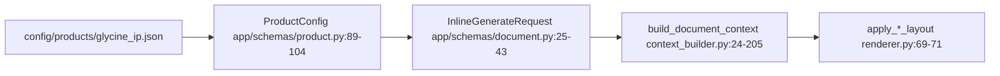

# AUDIT — Track B / B-1 Phase A: AWS/COA Render Capability Assessment

**Scope:** READ-ONLY assessment — what building AWS and COA rendering involves, reuse against existing layouts, and a **proposed** render-contract shape. No code changes.  
**Repo:** `AC-QMS-DOC-Module` (+ backend peek for domain shapes)  
**Date:** 2026-07-10  
**Governing docs:** Rev 2.3.1 (`AC-QMS-DEV-DOCS/Development_Bible_Rev2_3_1.md`); Track A complete (`sop_style.yaml` externalization).

**Constraint:** This report **maps and proposes**; it does not decide implementation.

---

## Executive summary

| Document | Closest existing layout | Reuse estimate | Net-new work |
|----------|-------------------------|------------------|--------------|
| **AWS** | `protocol_layout.py` (filled worksheet) | **~60%** structure/helpers | Filled per-section blocks, readings/result columns, OOS/expiry ack rows, per-section two-person sign-off, instrument/reagent display |
| **COA** | `spec_layout.py` / `moa_layout.py` chrome only | **~50%** header/footer/styling | Simple results table + compliance verdict paragraph; signature semantics differ from standing docs |

Neither `DocumentType.AWS` nor `DocumentType.COA` exists today. Backend `renderDocuments()` is a stub (`render-documents.service.ts:14-45`). `ProductConfig` + `InlineGenerateRequest` are designed for **standing** product documents, not per-batch execution payloads.

**Render-ready-data principle:** Fits AWS/COA. The **backend already pre-computes** results, limits strings, conclusions, and compliance verdict (`coa-generator.ts:28-86`, `117-133`). The renderer must **not** re-run formulas or conclusion logic. Several **existing** renderer paths **do** derive display values (section numbering, limit formatting, protocol summary) — those must **not** be copied into AWS/COA layouts.

---

## 1. Reuse analysis

### 1.1 AWS vs PROTOCOL

**Evidence:** Prior audit mapped AWS → protocol as closest match (`docs/audits/AUDIT_DocModule.md:268`). Real filled AWS is `GLYCINE IP.docx` (gateway audit: `docs/audits/glycine-downstream-audit.md:21-25` — *"filled AWS protocol with per-section procedures and AWS/GCN/01 revision history"*). The same file is already used as the **protocol** client reference in `tests/reference/GLYCINE IP.docx` (`tests/reference/README.md:7`).

#### Structural overlap (reusable as-is or with label/title changes)

| PROTOCOL component | Location | AWS reuse |
|--------------------|----------|-----------|
| Page setup + repeating header/footer wiring | `protocol_layout.py:458-464`, `wire_repeating_protocol_header_footer` `:188-205` | Same analytical margin profile pattern (via `sop_style.yaml` `PROTOCOL` entry) |
| 6-column bordered header (logo + title + metadata rows) | `build_protocol_header` `:78-142` | Retitle to AWS worksheet title; swap metadata labels (AWS No., ARN, batch) |
| Batch metadata table (mfg/exp, TRS, A.R. No., batch size, dates) | `_build_batch_info_table` `:218-259` | **High reuse** — same row shape; values come from `batch` dict today (`context_builder.py:196`) |
| 5-column summary (Sr / Tests / Results / Limits) | `_build_summary_table` `:262-317` | **High reuse** — PROTOCOL leaves Results blank (`context_builder.py:129-136`); AWS fills from `sections[]` |
| Compliance note paragraph | `COMPLIANCE_NOTE` `:55-57`, used `:312-317` | Reuse wording pattern (filled vs blank) |
| Body sign-off grid (Analyzed / Checked / Approved) | `_build_signoff_table` `:320-343` | Partial — document-level blank grid; AWS needs **per-section** analyst/checker **and** footer 3-stage approval |
| Per-test detail tables (procedure + observation + conclusion lines) | `_build_test_detail_block` `:403-432`, `_detail_content_paragraphs` `:346-364` | **Template only** — PROTOCOL emits **blank** placeholders (`OBSERVATION_LINE`, `ANALYZED_LINE`); AWS must render **filled** readings, computed result, conclusion, OOS/expiry ack |
| Revision history table | `build_protocol_body` `:448-455` | Reuse if AWS carries revision block (reference has AWS/GCN/01 history) |
| Table/paragraph helpers | `qa_layout_common.py`, `styles.py` | `setup_protocol_table`, `set_cell_text`, `add_logo_or_company`, `add_page_number_field`, grids from `sop_style.yaml` |

#### Genuinely new for AWS

| Requirement | Why PROTOCOL is insufficient |
|-------------|------------------------------|
| **Filled readings columns** | PROTOCOL summary `result` is always `""` (`context_builder.py:113-136`); detail blocks use underscore placeholders (`protocol_layout.py:62-63`, `359-363`) |
| **Backend-computed result display** | No `calculatedResult` / `resultDisplay` fields in `ProductConfig` or context |
| **Per-section conclusion** | Detail template prints static `"Conclusion: Satisfactory / Not satisfactory"` (`protocol_layout.py:362`) — not data-driven |
| **OOS acknowledgement row** | `aws_sections.oos_acknowledged`, `oos_ack_comment` (`schema.prisma:462-465`) — no renderer representation |
| **Instrument/reagent expiry ack** | `instrumentExpiredAck`, `reagentExpiredAck` in readings JSON (`aws.schema.ts:7-19`) — Epic 21 GAP 5b/5c |
| **Two-person rule per section** | `analyst` / `checker` on each `AwsSection` (`aws.types.ts:46-49`) vs document-level `approval` block only |
| **MOA procedure snapshot in section** | Real AWS embeds MOA procedure text per test (GAP 5d — `glycine-downstream-audit.md:138-141`); PROTOCOL uses standing `TestConfig.procedure` from product JSON |
| **Instrument lines (Balance ID, FTIR ID)** | Schema allows one `instrumentId` per section; reference shows multiple (`glycine-downstream-audit.md:124-128`) |
| **AWS document identity** | `AWS/GCN/01` numbering — not `PROT/FG…` (`01_document_numbering.md` via gateway audit) |

#### AWS reuse percentage: **~60%**

**Method (INFERRED):** Count major layout regions in `protocol_layout.py` (~8 regions: header, footer, batch table, summary, sign-off, detail blocks, revision, page chrome). ~5 regions reuse structure/helpers with parameterization; detail blocks and per-section execution data are largely new. Rounded: **60% reuse / 40% net-new**.

**Recommendation (proposal):** Implement `aws_layout.py` by **forking** `protocol_layout.py` patterns, not by calling `apply_protocol_layout` with hacks. Shared helpers stay in `qa_layout_common.py`; AWS-specific builders accept pre-resolved `sections[]`.

---

### 1.2 COA vs SPEC / MOA

**Evidence:** COA is a short **Analytical Report** (`Glycine IP 010326.docx` per `glycine-downstream-audit.md:22`). Backend row shape is stable (`coa_results` — `schema.prisma:483-494`; generator `coa-generator.ts:117-127`). COA generator structure assessed **no gap** (`glycine-downstream-audit.md:99-103`).

#### Structural overlap

| Existing component | Location | COA reuse |
|--------------------|----------|-----------|
| 6-column metadata header | `build_six_col_metadata_header` (`qa_layout_common.py:286-322`) | **High** — product/batch/COA no., dates; used by MOA (`moa_layout.py:40-56`) and SPEC (`spec_layout.py:113-127`) |
| QA approval footer (PREPARED / CHECKED / APPROVED) | `build_qa_approval_footer` (`qa_layout_common.py:146-194`) | **High** — same 6-col sign block; **semantics differ** (see §2) |
| Repeating header/footer | `wire_repeating_header_footer` (`qa_layout_common.py:207-251`) | MOA/SPEC pattern (`moa_layout.py:156-161`, `spec_layout.py:483+`) |
| Page setup from YAML | `configure_page_setup` + `sop_style.yaml` `document_types` | New `COA` entry needed (likely analytical profile) |
| Table styling | `setup_protocol_table`, `style_qa_cell`, SPEC grids | Results table is **simpler** than SPEC's multi-table body |

#### Genuinely new for COA

| Requirement | Why SPEC/MOA is insufficient |
|-------------|------------------------------|
| **Results-only body** | SPEC body is product metadata + parameter tables (`spec_layout.py:146+`); MOA is procedure blocks (`moa_layout.py:92-141`). COA needs **one flat table**: test / result / limits / conclusion |
| **Compliance verdict** | `compliance_verdict` on `batch_documents` (`schema.prisma:393`) — no layout exists; enum → human phrase is display-only (`epic-21-pdf-display.md:11-27`) |
| **No procedure / MOA text** | COA rows are already flattened in `coa_results` |
| **Signature semantics** | At auto-gen: `createdById` = AWS creator, `qcApprovedById` = AWS QC approver, `qaSignedById` = null (`coa-generator.ts:135-141`). At issue: QA_MGR signs (`documents.service.ts:124-127`). Footer labels match standing docs but **roles map from batch_document FKs**, not SPEC `approval` from product JSON |
| **Customer-facing title** | Short COA title may differ from "FINISHED PRODUCT SPECIFICATION" / MOA headings |
| **Per-row conclusion wording** | Generator emits `Satisfactory` / `Pass` (`coa-generator.ts:49-61`); client COA may show "Complies" per row (`epic-21-pdf-display.md:45-53`) — **backend should send final display strings** |

#### COA reuse percentage: **~50%**

**Method (INFERRED):** COA is mostly **chrome** (header/footer/page setup ≈ half the code in MOA/SPEC layout files) plus a **small new body** (one results table + verdict). SPEC's complex multi-page parameter tables are **not** reused. Rounded: **50% reuse / 50% net-new** (body is small in absolute LOC but entirely new).

---

## 2. Proposed input schemas (render contract)

> **Label:** PROPOSAL for review — not an approved API contract.

### 2.1 Design principle: render-ready data

| Layer | Responsibility |
|-------|----------------|
| **Backend (Node)** | Load `aws_sections` / `coa_results`, batch, product identity, users; compute/format every displayed string; map to render payload |
| **Renderer (Python)** | Validate payload, lay out DOCX/PDF, apply `sop_style.yaml`; **no** formula engine, **no** pass/fail logic, **no** compliance verdict computation |

**Confirmed fit:** Backend already formats limits (`formatAcceptanceLimits`), results (`formatSectionResult`), conclusions (`formatConclusionLabel`), and verdict (`computeComplianceVerdict`) in `coa-generator.ts`. AWS section DTOs expose `resultDisplay`, `conclusion`, `isOos` post-compliance service (`aws.types.ts:22-51`).

**Flag — current renderer derives data (must NOT copy for AWS/COA):**

| Derivation | Location | AWS/COA stance |
|------------|----------|----------------|
| Section numbering `1.0`, `2.0` | `section_numbering.py:52-78`, called from `context_builder.py:86-97` | Backend sends `section_no` or omits if not shown on COA |
| `acceptance_criteria_display` from raw criteria | `section_numbering.py:114-122` | Backend sends `limits_display` string per section/row |
| `protocol_summary` row assembly | `context_builder.py:99-156` | Backend sends `summary_rows[]` or `sections[]` fully shaped |
| Auto `document_no` from product code | `context_builder.py:50-55` | Backend sends explicit `document_no` / `aws_no` / `coa_no` |
| `molecular_weight` + `" g/mole"` | `moa_layout.py:35-37`, `spec_layout.py:110-112` | Backend sends display-ready `molecular_weight_display` if needed |
| Compliance verdict phrase | N/A today | Backend sends `compliance_remark` string (enum mapping in Node per `epic-21-pdf-display.md:23-27`) |

---

### 2.2 Proposed `AwsRenderInput` (Pydantic)

Separate from `ProductConfig` — batch execution document.

```python
# PROPOSAL — app/schemas/aws_render.py

class BatchIdentity(BaseModel):
    batch_no: str
    arn_no: str | None = None
    mfg_date: str | None = None          # display-formatted, e.g. "01 FEB 2026"
    exp_date: str | None = None
    batch_size: str | None = None
    quantity_sampled: str | None = None
    test_request_no: str | None = None
    received_date: str | None = None
    testing_date: str | None = None
    completion_date: str | None = None

class ProductIdentity(BaseModel):
    product_name: str
    product_code: str | None = None
    reference: str | None = None
    specification_no: str | None = None
    moa_no: str | None = None

class PersonSignature(BaseModel):
    name: str | None = None
    designation: str | None = None
    signature: str | None = None          # image path or embedded ref — TBD in B-2
    date: str | None = None

class DocumentApproval(BaseModel):
    prepared_by: PersonSignature = Field(default_factory=PersonSignature)
    checked_by: PersonSignature = Field(default_factory=PersonSignature)
    approved_by: PersonSignature = Field(default_factory=PersonSignature)

class AwsSectionRender(BaseModel):
  sort_order: int
  section_no: str | None = None         # e.g. "1.0" — backend-resolved
  test_name: str
  limits_display: str                   # snapshot limit string
  procedure_text: str | None = None     # MOA snapshot prose, pre-joined
  readings_display: str | None = None   # human-readable observation block
  calculated_result: str | None = None  # optional; quantitative
  result_display: str                   # primary result cell
  conclusion_display: str               # e.g. "Satisfactory"
  is_oos: bool = False
  oos_acknowledged: bool = False
  oos_ack_comment: str | None = None
  instrument_display: str | None = None # pre-formatted lines (Balance/FTIR) — backend
  reagent_display: str | None = None
  instrument_expired_ack: bool = False
  reagent_expired_ack: bool = False
  expiry_ack_comment: str | None = None
  analyst: PersonSignature = Field(default_factory=PersonSignature)
  checker: PersonSignature = Field(default_factory=PersonSignature)

class AwsRenderInput(BaseModel):
    document_no: str                      # e.g. AWS/GCN/01
    document_no_label: str = "AWS NO."
    document_type_label: str = "ANALYTICAL WORKSHEET"  # title text — confirm vs reference
    revision_no: str = "01"
    effective_date: str | None = None
    review_date: str | None = None
    superseded_revision: str | None = None
    company_name: str = "Aditya Chemicals"
    department: str = "QUALITY ASSURANCE"
    product: ProductIdentity
    batch: BatchIdentity
    sections: list[AwsSectionRender]
    summary_rows: list[dict] | None = None   # optional pre-built Sr/Tests/Results/Limits rows
    compliance_note: str | None = None       # filled compliance sentence if required
    approval: DocumentApproval              # document-level 3-stage (QC/QC/QA workflow)
    revision_history: list[RevisionHistoryEntry] = Field(default_factory=list)
    logo_path: str | None = None
    metadata: dict[str, Any] = Field(default_factory=dict)
```

**Backend mapping source (Rev 2.3.1):** `aws_sections` + `spec_document_tests` (limits snapshot) + `moa_document_sections` (procedure snapshot) + `batches` + `batch_documents` + user relations (`schema.prisma:359-481`).

---

### 2.3 Proposed `CoaRenderInput` (Pydantic)

```python
# PROPOSAL — app/schemas/coa_render.py

class CoaResultRow(BaseModel):
    sort_order: int
    test_name: str
    result: str
    acceptance_limits: str | None = None
    conclusion: str | None = None         # display string, e.g. "Satisfactory" or "Complies"

class CoaRenderInput(BaseModel):
    document_no: str
    document_no_label: str = "COA NO."    # confirm — real COA may use "Analytical Report" only
    document_type_label: str = "CERTIFICATE OF ANALYSIS"
    revision_no: str = "01"
    effective_date: str | None = None
    review_date: str | None = None
    company_name: str = "Aditya Chemicals"
    product: ProductIdentity
    batch: BatchIdentity
    coa_results: list[CoaResultRow]
    compliance_verdict: Literal["COMPLIES", "DOES_NOT_COMPLY"]
    compliance_remark: str                # e.g. "Complies with the IP specification"
    approval: DocumentApproval
    # COA signature semantics (pre-resolved by backend):
    # prepared_by  ← batch_document.created_by (AWS creator)
    # checked_by   ← batch_document.qc_approved_by (AWS QC approver)
    # approved_by  ← batch_document.qa_signed_by (QA_MGR at sign-and-issue)
    revision_history: list[RevisionHistoryEntry] = Field(default_factory=list)
    logo_path: str | None = None
```

**Backend mapping source:** `coa_results` + `batch_documents.compliance_verdict` + user FKs set in `generateCoaFromSignedAws` / `transitionCoaDocumentToIssued` (`coa-generator.ts:117-141`, `documents.service.ts:124-127`).

---

### 2.4 API envelope (proposal)

Extend or parallel `InlineGenerateRequest` (`app/schemas/document.py:25-43`):

```python
class InlineAwsGenerateRequest(BaseModel):
    document_type: Literal["aws"]
    payload: AwsRenderInput

class InlineCoaGenerateRequest(BaseModel):
    document_type: Literal["coa"]
    payload: CoaRenderInput
```

**Alternative (proposal):** Single `POST /render` with discriminated union on `document_type` — keeps standing `product: ProductConfig` and batch types separate (cleaner validation than forcing AWS into `ProductConfig`).

---

## 3. How existing document types define their contract

### 3.1 Input model chain



### 3.2 `ProductConfig` (standing documents)

```89:104:AC-QMS-DOC-Module/app/schemas/product.py
class ProductConfig(BaseModel):
    product_code: str
    product_name: str
    reference: str | None = None
    molecular_weight: str | None = None
    chemical_formula: str | None = None
    specification_no: str | None = None
    moa_no: str | None = None
    protocol_no: str | None = None
    department: str = "QUALITY ASSURANCE"
    tests: list[TestConfig] = Field(default_factory=list)
    additional_tests: list[TestConfig] = Field(default_factory=list)
    microbiological_tests: list[TestConfig] = Field(default_factory=list)
    sop_sections: list[SopSection] = Field(default_factory=list)
    revision_history: list[RevisionHistoryEntry] = Field(default_factory=list)
    metadata: dict[str, Any] = Field(default_factory=dict)
```

Nested `TestConfig` carries `procedure`, `acceptance_criteria`, `instruments`, `reagents`, `sub_tests` (`product.py:44-52`). **No batch execution fields.**

### 3.3 Request wrappers

| Model | Purpose | Key extra fields |
|-------|---------|------------------|
| `DocumentGenerateRequest` | DB-backed generate (`document.py:9-22`) | `product_id`, `batch_id`, `approval`, dates |
| `InlineGenerateRequest` | Stateless inline (`document.py:25-43`) | `product: ProductConfig`, `batch: dict`, `approval`, `extra_context` |

`document_type` literal today: `"moa" | "protocol" | "specification" | "sop" | "annexure"` only (`document.py:31`).

### 3.4 Context dict (what layouts actually read)

`build_document_context()` merges product config + kwargs into a flat dict (`context_builder.py:165-205`):

- Identity: `product_name`, `document_no`, `document_no_label`, `specification_no`, `moa_no`, `protocol_no`
- Lists: `tests`, `all_tests`, `protocol_summary`, `sop_sections`
- Batch: `batch` dict (protocol only uses subset today — `protocol_layout.py:96-100`, `218-256`)
- Approval: `approval` / `prepared_by` / `checked_by` / `approved_by`
- Assets: `logo_path`, `footer_text`

**PROTOCOL** additionally requires `batch` in fixtures (`tests/conftest.py:38-41`). **MOA/SPEC** use `tests` from product JSON. **SOP** uses `sop_sections`.

### 3.5 Fixture sources today

| Fixture | Path | Used for |
|---------|------|----------|
| `glycine_ip.json` | `config/products/glycine_ip.json` | MOA, PROTOCOL, SPEC golden + smoke |
| `sop_on_sop.json` | `config/products/sop_on_sop.json` | SOP, ANNEXURE |
| `common_kwargs` / `approval` | `tests/conftest.py:81-98` | All golden cases |
| Client reference DOCX | `tests/reference/*.docx` | Subset structural compare (`MATCH_STATE.md`) |

**No AWS/COA JSON fixture exists.**

---

## 4. STANDING_SPEC → SPEC + MOA mapping

### 4.1 What the backend does today

On standing SPEC QA sign, workflow calls **one** render stub:

```419:427:AC-QMS-API-Gateway/src/services/workflow-engine.ts
  await renderDocuments(
    "STANDING_SPEC",
    entity.id,
    {
      userId: actor.userId,
      docNo: entity.specNo,
    },
    tx,
  );
```

`RenderDocType` enum: `"STANDING_SPEC" | "AWS" | "COA"` (`render-documents.service.ts:7`) — **no** `MOA` or `SPECIFICATION` split at the gateway seam.

### 4.2 What the renderer has

Separate programmatic layouts:

```34:38:AC-QMS-DOC-Module/app/document_engine/renderer.py
PROGRAMMATIC_LAYOUTS = {
    DocumentType.PROTOCOL: apply_protocol_layout,
    DocumentType.MOA: apply_moa_layout,
    DocumentType.SPECIFICATION: apply_spec_layout,
    DocumentType.SOP: apply_sop_layout,
}
```

SPEC and MOA share **no** combined layout — different body structures (`spec_layout.py` vs `moa_layout.py`). Rev 2.3.1: *"Python microservice renders DOCX/PDF for SPEC+MOA (on approval)"* (`Development_Bible_Rev2_3_1.md:29`).

### 4.3 Options

| Option | Description | Fit |
|--------|-------------|-----|
| **A. Two render calls** | `renderDocuments` → HTTP `specification` + `moa` with separate payloads from one mapper | **Cleanest** — matches existing `DocumentType` split, separate golden baselines, independent file attachments |
| **B. Combined document type** | New `STANDING_SPEC` layout rendering both in one DOCX | **Poor fit** — no precedent; SPEC is multi-page tables, MOA is procedure blocks; different headers; would fight pagination |
| **C. ZIP / multi-file response** | Single API call returns two files | Orchestration in gateway; renderer stays two calls internally |

**Proposal:** **Option A** — gateway `mapToStandingSpecRender` (name TBD) produces two payloads; invoke Python twice (or one batch endpoint returning two paths). Keep `STANDING_SPEC` as **orchestration label** in Node only, not a Python `DocumentType`.

**Data split (INFERRED):**

| Python type | Backend source |
|-------------|----------------|
| `SPECIFICATION` | `specs`, `spec_tests`, product master fields |
| `MOA` | `moa_docs`, `moa_doc_sections.procedureSnapshot` merged into test procedures |

Prior audit noted this gap (`AUDIT_DocModule.md:266-267`).

---

## 5. Golden-net implications (Track A B1 pattern)

### 5.1 What B1 established

- Structural fingerprints: `tests/docx_structure.py`, baselines under `tests/golden/fingerprints/*.json`
- Golden DOCX: `tests/golden/docx/*.docx`
- Regression: `tests/test_style_regression.py` (14 tests)
- Update: `pytest --update-golden` / `scripts/update_golden.py`
- Client reference subset: `tests/reference/` → `MATCH_STATE.md`

Current keys: `moa`, `protocol`, `spec`, `sop`, `annexure` (`tests/conftest.py:25-64`).

### 5.2 Fixtures needed for AWS/COA goldens

| Artifact | Status | Proposal |
|----------|--------|----------|
| **AWS render JSON** | **Missing** | New `tests/fixtures/glycine_aws_gcn010226.json` (or `config/batch_documents/…`) built from ground-truth (`glycine_ip_groundtruth_reference.doc`) + backend DTO shape |
| **COA render JSON** | **Missing** | New `tests/fixtures/glycine_coa_gcn010226.json` with `coa_results[]` matching `coa-generator` output |
| **Product JSON reuse** | Partial | Identity fields can copy from `glycine_ip.json`; execution data is batch-specific |
| **Approval block** | Reuse pattern | `tests/conftest.py:81-87` — but COA signatures must reflect AWS lineage semantics |

### 5.3 Reference DOCX for client subset

| Reference | Location today | Role |
|-----------|----------------|------|
| `GLYCINE IP.docx` | `AC-QMS-DOC-Module/tests/reference/` (as Protocol) | **Same file** is filled AWS per gateway audit (`glycine-downstream-audit.md:21-25`) — can seed **AWS** `MATCH_STATE` comparison once layout exists |
| `Glycine IP 010326.docx` | `AC-QMS-API-Gateway/docs/` only | COA short report — **copy to** `tests/reference/` for COA subset tests (optional gitignore) |
| `AWS_FILLED_GCN_010226` | **Not found** under that filename | User prompt name; ground-truth batch is `GCN/010226` (`Development_Bible_Rev2_3_1.md:222`, `glycine-downstream-audit.md:34`) |

**Golden workflow (proposal):**

1. Add `RENDER_CASES` entries `aws`, `coa` in `tests/conftest.py`
2. Render from fixture JSON → fingerprint → `tests/golden/fingerprints/aws.json`, `coa.json`
3. Add `test_client_reference_subset_if_present` rows when reference DOCXs are present
4. Expect initial **DIVERGE** on grids/margins until layout tuned (same pattern as MOA/PROTOCOL today — `tests/reference/MATCH_STATE.md`)

---

## 6. Document type registration checklist (B-1 Phase B)

Every touchpoint required to add `AWS` and `COA`:

| # | Location | Change |
|---|----------|--------|
| 1 | `app/core/constants.py` | Add `DocumentType.AWS`, `DocumentType.COA`; `DOCUMENT_NUMBER_PREFIX` entries |
| 2 | `app/document_engine/sop_style.yaml` | `document_types.AWS`, `document_types.COA` (margin profile, border, footer, header_layout); `document_labels`, `document_type_labels`; optional `tables.aws` / `tables.coa` grid constants |
| 3 | `app/document_engine/sop_style.py` | Pydantic models accept new keys (if typed per family) |
| 4 | `app/document_engine/styles.py` | Loader-backed constants if AWS/COA need dedicated grids |
| 5 | `app/document_engine/components/aws_layout.py` | **New** — `apply_aws_layout` |
| 6 | `app/document_engine/components/coa_layout.py` | **New** — `apply_coa_layout` |
| 7 | `app/document_engine/renderer.py` | `PROGRAMMATIC_LAYOUTS`, optional `TEMPLATE_MAP` if docxtpl fallback |
| 8 | `app/schemas/aws_render.py`, `coa_render.py` | **New** Pydantic models (proposal §2) |
| 9 | `app/schemas/document.py` | Extend `InlineGenerateRequest` or add parallel request types |
| 10 | `app/document_engine/context_builder.py` | Either thin adapter `build_aws_context(AwsRenderInput)` or bypass for batch types |
| 11 | `app/api/routes/documents.py` | `_DOC_TYPE_MAP`, `POST /aws/generate`, `POST /coa/generate` or unified `/render` |
| 12 | `tests/conftest.py` | `RENDER_CASES` + fixture JSON paths |
| 13 | `tests/test_style_regression.py` | Parametrize new keys (automatic if `RENDER_CASES` extended) |
| 14 | `tests/test_document_render.py` | Smoke cases for AWS/COA |
| 15 | `tests/test_sop_style_parity.py` | `EXPECTED_PAGE_SETUP` entries for AWS/COA |
| 16 | `scripts/update_golden.py` | No change if driven by pytest (verify) |
| 17 | `template_builder/builder.py` | Only if docxtpl base needed (unlikely — programmatic path) |
| 18 | **Gateway** `mapToSopConfig` / HTTP client | **New** — map Prisma → `AwsRenderInput` / `CoaRenderInput`; wire `renderDocuments` stub |
| 19 | **Gateway** `render-documents.service.ts` | HTTP call to DOC-Module; handle `STANDING_SPEC` as two calls (§4) |

---

## 7. Build-size verdict

| Document | Verdict | Effort drivers |
|----------|---------|----------------|
| **AWS** | **Reuse-and-extend** (not greenfield) | ~60% protocol DNA; largest work is **filled detail sections** + per-section signatures/OOS/expiry + mapper from `aws_sections` with MOA procedure snapshots |
| **COA** | **Moderate net-new** (small absolute size) | ~50% reuse of QA chrome; body is one table + verdict but **new layout file** + signature semantics + verdict phrase |
| **Gateway mapper** | **Substantial** (both types) | No `mapToSopConfig` exists; must join batch, snapshot tests, users, formatted strings |
| **Integration** | **Medium** | Replace render stub; `file_attachments` persistence; PDF path |

**Relative sizing (INFERRED):** AWS ≈ **1.5–2×** COA in layout LOC (protocol-scale body); COA ≈ **0.5×** AWS in mapper complexity (flattened rows already in `coa-generator`). Standing SPEC→MOA mapper is **separate** from AWS/COA but shares `ProductConfig` patterns.

**Risk items (not layout LOC):**

- Instrument display multi-line (GAP 5b) — may need `instrument_display` string from backend
- Batch header fields not on `Batch` model (TRS, quantity sampled, received/testing dates — `epic-21-pdf-display.md:70-79`)
- Numbering FG vs GCN dual-code (`glycine-downstream-audit.md:47-68`) — display in header, not renderer logic
- Assay cross-section formula display on AWS — data must arrive pre-computed in `result_display`

---

## 8. Verification checklist (this audit)

| # | Check | Status |
|---|-------|--------|
| 1 | No files changed except this report | ✅ |
| 2 | Reuse analysis with % per type | ✅ §1 (AWS ~60%, COA ~50%) |
| 3 | Proposed AWS + COA input schemas | ✅ §2 (labeled PROPOSAL) |
| 4 | Render-ready-data principle checked vs current renderer | ✅ §2.1 |
| 5 | STANDING_SPEC → SPEC+MOA mapping documented | ✅ §4 (two calls proposed) |
| 6 | Golden-fixture path identified | ✅ §5 |
| 7 | Doc-type registration checklist | ✅ §6 |
| 8 | Build-size verdict | ✅ §7 |

---

## 9. Suggested B-1 Phase B sequence (proposal only)

1. **Approve** `AwsRenderInput` / `CoaRenderInput` shapes (adjust against real `GLYCINE IP.docx` / `Glycine IP 010326.docx`).
2. **Register** `DocumentType` + `sop_style.yaml` entries (margins before body).
3. **Implement COA layout** first — smaller surface, validates batch render path + golden net.
4. **Implement AWS layout** — extend protocol patterns + fixtures from ground-truth batch.
5. **Gateway mapper** + HTTP integration replacing stub.
6. **Golden + client reference** rows for `aws` / `coa`.

---

*End of Track B / B-1 Phase A assessment.*
